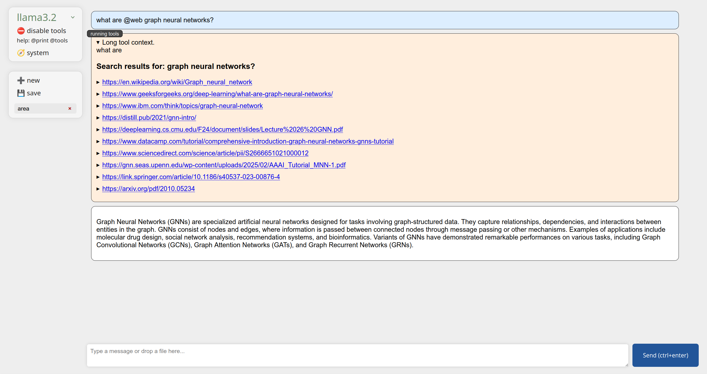

# CHATOLLAMA

This is a simple frontend for ollama models that works like a question answering page.
I have been mostly using it for simple searches when my internet connectivity is bad
(so I cannot look up documentation online) or writing code that cannot be made public.

It is somewhat similar to chatGPT but private and controlled by you. Also different I think
from other Ollama tooling if you, like me, prefer using LLMs as advanced search engines
instead of being limited to code editor integration. I donnot trust models with command line access.

This repo is nothing you could not vibe-code yourself, but is released under MIT license anyway.
Would appreciate some acknowledgement.



## Capabilities

- [x] Chat
- [x] System context
- [x] Select your models
- [x] Code highlighting
- [x] File uploads
- [x] Controlled tooling
- [ ] Tools asking for user interaction
- [ ] Automatic discovery and integration of ollama models


## Instructions

Install ollama and pull some models. Link: [https://ollama.com/](https://ollama.com/)

Clone this repository, create a Python virtual environment, and install necessary dependencies:

```bash
python -m venv venv
source venv/bin/activate
(venv) pip install -r requirements.txt
```

Then launch the service and visit the printed localhost site from your browser:

```bash
(venv) python -m server
http://localhost:8088/
```

To have pdf processing and syntax highlighting offline, you can create a *link/* directory and
populate it with stuff that is normally retrieved from *cdnjs*. Look at the requirements in *index.html*,
which has both the online and offline version links. Not distributing those myself because I am worried
about violating some license. Perhaps will automatically hydrate that directory in the future.

## Tooling

You may notice that there is an option to add some tooling options. This is my own
take on the subject that tries to stay responsible by not modifying the machine without
permission; tools are there to help the answer with additional context or information.

If you want to execute commands automatically, sorry but I am not going to help you erase
your hard drive automatically. You can ask for commands and paste them in your console yourself.
Like an adult.

Syntax for tools is: `@toolname(arguments)`

You can ommit the parentheses if the rest of the sentence should be used as arguments.
Arguments can be the outputs of other tools too. That is, you can chain stuff.
If multiple are needed, they may be separated
by spaces or commas, though usually you would just write some more text in there.

Tools calls replace themselves with obtained text. For example, you can ask questions like the
following to pull information from wikipedia or the web and have the model summarize it:

```
what are some good recipes for @wiki bananas
what is @web python
```

If you do not want the model to answer on the tool outcome, use the `@print` tool like this:

```
@print @wiki ducks
```
